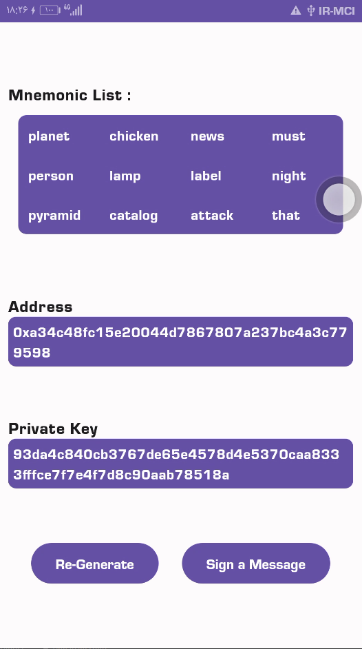

  <h1>Offline Ethereum Wallet</h1>

  

    A Sample Project which can create Ethereum wallet information and sign a message with its key   
  

<h4>
    <a href="sample/apks/app-debug.apk">View Demo</a>
   · 
     </h4>

 

<!-- About the Project -->
## :star2: About the Project

    we use Web3j and clean architecture to create sample Android app with Kotlin 
this is just offline test of creating the Wallet base on Ethereum Crypto Currency
if you want to get6 balance or transaction must connect to a TestNet or MainNet with infura or etc. 
  

<!-- Screenshots -->
### :camera: Screenshots

 
  
 

<!-- TechStack -->
### :space_invader: Main Features

  
Architecture

  <ul>
    <li><a href="https://developer.android.com/topic/architecture">Google Clean Architecture</a></li>
    <li><a href="https://developer.android.com/jetpack/compose">Jetpack Compose</a></li>
    <li><a href="https://oozou.com/blog/reasons-to-use-android-single-activity-architecture-with-navigation-component-36">Single Activity</a></li>
  </ul>

  
Language

  <ul>
    <li><a href="https://kotlinlang.org/">Kotlin</a></li>
  </ul>

  
Dependency Injection

  <ul>
  <li><a href="https://developer.android.com/training/dependency-injection/hilt-android/">Hilt (dependency Injection)</a></li>
  </ul>

Some Other

  <ul>
 <li><a href="https://github.com/web3j/web3j/">Web3j</a></li>
   <li><a href="https://developer.android.com/kotlin/flow">Continuous Flow (react programming)</a></li>
    <li><a href="https://developer.android.com/kotlin/flow">live data (lifecycle of fragments)</a></li>
    </ul>

<!-- practice -->
## :dart: practices

* [x] Get Mnemonic Data
* [x] Create Private key based on MnemonicKey
* [x] Create WalletAddress based on MnemonicKey
* [x] Re-Generate Wallet on click
* [x] sign message by private key

<!-- time -->
## :dart: TimeStamp

I start implementing this project on 8/19/2023 at 7:30 and will will end at 8/19/2023 at 19:00 
because I need to study more about currency most of the time was on researching (can check git flow commit timestamp)
total time on project is about 12:00 hr

<!-- todos -->
### :compass: ToDo Roadmap

- Modular Programming
    + refactoring codes and use Modular Programming to handle in large scale

- Write More Unit Test
    + just implement some few unit test to show but it is more advised to write more Unit test

- Write Some Mid Test and UI Test
    + you can write some integration Tests and Ui Tests to reliable whole system

<!-- Acknowledgments -->
## :gem: Preview

you can find the output apk file in below url :

- [SampleTest.apk](https://github.com/MOSTAFA-IMANI/WalletEthereumTest/blob/master/sample/apks/app-debug-sample.apk)

<!-- Contributing -->
## :wave: Contributing

it's just a sample Project but Contributions are always welcome!

<!-- Contact -->
## :handshake: Contact

Mostafa Imani - [Linkdin](https://www.linkedin.com/in/mostafa-imani/) - imani.mostafa.74@gmail.com

